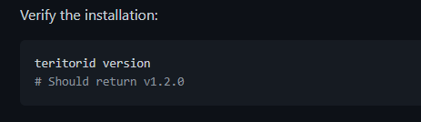

# 如何用cli客户端查询合约信息

## 问题背景

群友提问：知道应用链的CW合约地址，如何查询合约信息？

群友提问的应用链是Teritori，本文就用该链作为目标链，在本地使用cli客户端查询链上的合约信息。其余应用链的原理相似，可以自己探索。

## 本地安装cli客户端工具

每条Cosmos应用链都提供了一个cli工具，用于与链交互，但需要自己编译安装，本小节讲解如何安装。系统使用Ubuntu 22.04。

到Teritori的Github：[teritori-chain](https://github.com/TERITORI/teritori-chain/tree/main/mainnet/teritori-1)，上面有详细的安装信息，该教程是教用户如何跑节点的，但我们不需要跑节点，因此无需走完全部流程，到下图的步骤即可：



## 配置主网节点信息

装好cli后，第二步就是给cli工具配置节点信息，这样cli才知道要与链的哪个节点交互。

输入指令`teritorid config`即可查询当前配置的节点：

```json
{
        "chain-id": "",
        "keyring-backend": "os",
        "output": "text",
        "node": "tcp://localhost:26657",
        "broadcast-mode": "sync"
}
```

可以看到目前节点信息是**本地节点**，需要将其改为**主网节点**。但要去哪里找主网节点信息？

Cosmos每条链的基本信息(包括主网测试网)都在此Github仓库维护：[cosmos/chain-registry (github.com)](https://github.com/cosmos/chain-registry)

使用其他应用链同理，到该仓库找链信息/节点信息即可。

好，到Teritori目录的该文件下：[chain-registry/chain.json](https://github.com/cosmos/chain-registry/blob/master/teritori/chain.json)

里面可看到当前提供主网RPC服务的节点信息，选择`polkachu`提供的RPC(随意选择，网络不通就换一个)，配置cli节点，指令：

```bash
teritorid config node https://teritori-rpc.polkachu.com:443 
```

再次查询配置节点`teritorid config`：

```
{
        "chain-id": "",
        "keyring-backend": "os",
        "output": "text",
        "node": "https://teritori-rpc.polkachu.com:443",
        "broadcast-mode": "sync"
}
```

配置完成。

## 查询合约信息

现在就可以查询Teritori链上合约的信息了，但在此之前需要补充点背景知识：

链上每一个CW合约都对应的一个`code ID`，该ID表示链上的一个可执行的二进制wasm字节包，cli工具靠该`code ID`与具体的合约交互。

如果知道了合约地址是`tori1j08452mqwadp8xu25kn9rleyl2gufgfjnv0sn8dvynynakkjukcq3vtuv2`，如何得到它的`code ID`？

可以通过指令查询：

```bash
teritorid q wasm contract tori1j08452mqwadp8xu25kn9rleyl2gufgfjnv0sn8dvynynakkjukcq3vtuv2
```

返回信息：

```
address: tori1j08452mqwadp8xu25kn9rleyl2gufgfjnv0sn8dvynynakkjukcq3vtuv2
contract_info:
  admin: tori1x3mkdhgzmym0x7mhpsqxyrylfrv7merj8xrlfc
  code_id: "5"
  created: null
  creator: tori1mf6ptkssddfmxvhdx0ech0k03ktp6kf9yk59renau2gvht3nq2gqg87tkw
  extension: null
  ibc_port_id: ""
  label: CW721-5 The R!ot
```

可以看到`code ID`为5。

有了该ID，也可以查合约地址，指令：

```bash
teritorid q wasm code-info 5
```

返回信息：

```
code_id: "5"
creator: tori1x3mkdhgzmym0x7mhpsqxyrylfrv7merj8xrlfc
data_hash: B36E995623647F8070C5965CC04AB17A3C4CE6104F00216C9A9140E6C4CB6708
instantiate_permission:
  address: ""
  permission: Everybody
```

查看`code ID`对应的所有CW合约(这意味着一个wasm包可以对应多个合约？)：

```
teritorid q wasm list-contracts-by-code 5
```

返回信息：

```
contracts:
- tori1436kxs0w2es6xlqpp9rd35e3d0cjnw4sv8j3a7483sgks29jqwgsjscd88
- tori1j08452mqwadp8xu25kn9rleyl2gufgfjnv0sn8dvynynakkjukcq3vtuv2
- tori12pwnhtv7yat2s30xuf4gdk9qm85v4j3e6p44let47pdffpklcxlq34lcwf
- tori149ltwdnpxrhx9al42s359glcjnsuc6x3dalz28f04dsxhlu7jhmqpkeg75
- tori1c2f79k5kykr5s4zhknn5w56hs5c9a8zxh4w03x07dnzwyrcj4pfs9ytu6s
- tori13h9k5rsrgveg6sdtzg34qg499ns0e5kku74kapnskegtwyfspf6q7j2z9u
- tori16t6tucgcqdmegye6c9ltlkr237z8yfndmasrhvh7ucrfuqaev6xqppdemd
- tori172v738ut05le2272gm6akv9hw2jqfwfkm7ej7ndy53skxq757s5szfrrt3
- tori19ttnpna4fpwuhw9dwjukah5esz9ruutquuvhxa7ulyyk047vvpvsp2mjv8
- tori1q6zlut7gtkzknkk773jecujwsdkgq882zxj6hh0hv7my9qwfn90q608n9m
- tori1q6kpxy6ar5lkxqudjvryarrrttmakwsv32ahx8smkksp6dqq87mspyj32g
- tori1ujx2uxgzh3sqy6fs5m0zetrdglapyfvter3l6urz60y2rlmkdd0qlxn27t
- tori1dtaakf99dllanxn0sg0ryft4j9fsewypgns5gavev6tz49mw0wdsxvfwug
pagination:
  next_key: null
  total: "0"
```

上述是查看合约在链上的基本信息，也可以查询合约自己的状态信息：

如指令：

```
teritorid q wasm contract-state smart tori1j08452mqwadp8xu25kn9rleyl2gufgfjnv0sn8dvynynakkjukcq3vtuv2 '{"config":{}}'
```

出现报错：

```
Error: rpc error: code = InvalidArgument desc = Error parsing into type cw721_base::msg::QueryMsg<candymachine::token::Cw2981QueryMsg>: unknown variant `config`, expected one of `owner_of`, `approval`, `approvals`, `all_operators`, `num_tokens`, `contract_info`, `nft_info`, `all_nft_info`, `tokens`, `all_tokens`, `minter`, `extension`: query wasm contract failed: invalid request
......
```

可以看到该合约只支持这些查询参数：`owner_of`, `approval`, `approvals`, `all_operators`, `num_tokens`, `contract_info`, `nft_info`, `all_nft_info`, `tokens`, `all_tokens`, `minter`

再次查询：

```
teritorid q wasm contract-state smart tori1j08452mqwadp8xu25kn9rleyl2gufgfjnv0sn8dvynynakkjukcq3vtuv2 '{"num_tokens":{}}'
```

返回信息：

```
data:
  count: 3000
```

**每一个查询字段接受的参数不一样，要看合约源码才知道，但没找到该合约的源码，所以没接口，有些查询用不了。**

## 总结

本文主要讲解如何在本地使用Cosmos cli客户端工具查询链上的合约信息，除了查询也可以做执行。

事实是不仅合约，任何链上操作都可以用cli工具完成，所以每个Cosmos的程序员务必掌握该工具。

